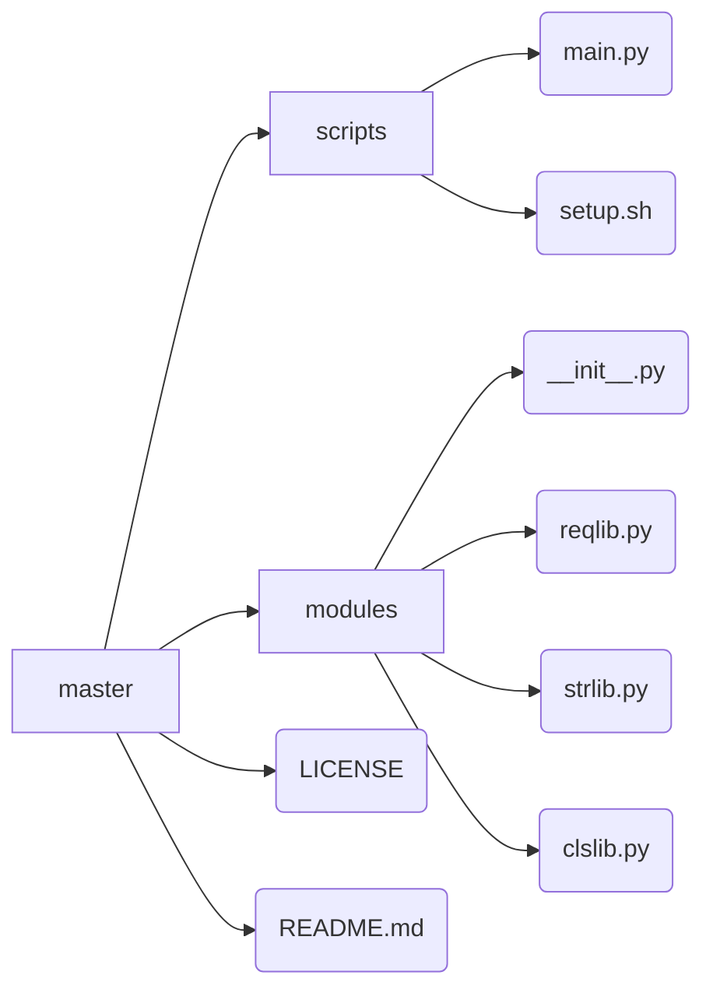

# USYD Canvas Grade Fetcher

This set of scripts helps you retrieve marks from [Canvas](https://canvas.sydney.edu.au).

## Environment
OS Requirements:
- Linux, Unix, MacOS and 
- Partly supports Windows
- Python3.x

## Structure

Function libs and class libs are both stored in /modules as:

## Library details
### reqlib
reqlib defines the way to visit web pages.
#### `get_referer`
#### `get_page`
- takes 5 parameters:
	- `url` positional, as the requested target
	- `headers` default, to set request headers 
	- `data` default, to be encoded and `POST` to target
	- `login_check` default, to modify the function return value to include login status

### strlib
### clslib
